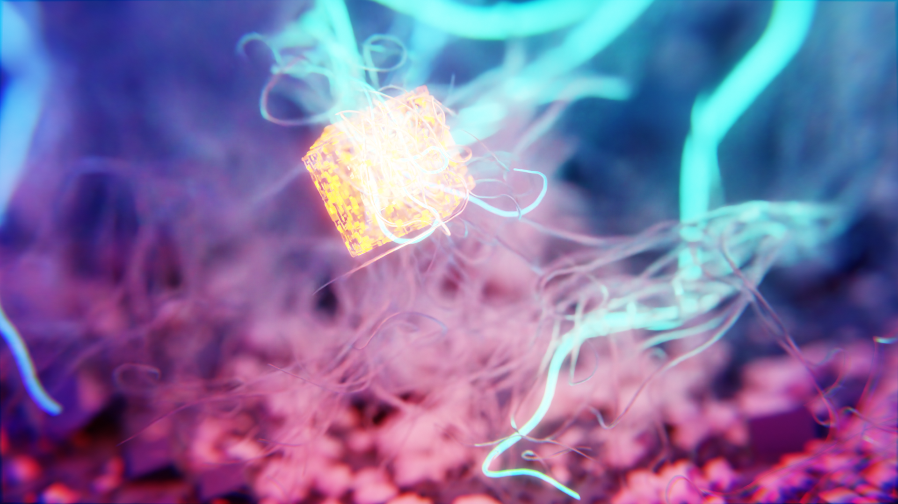
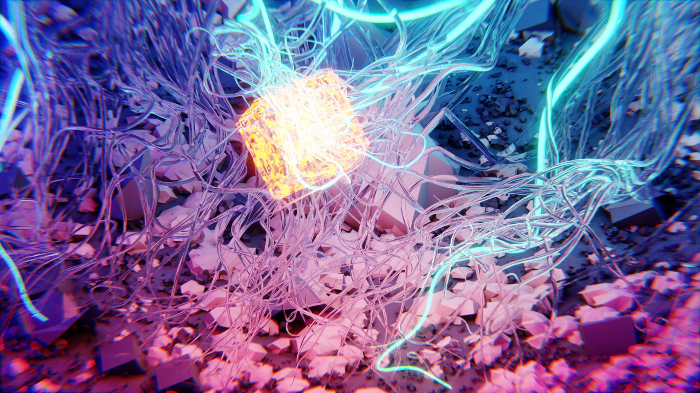

---
date:
  created: 2023-05-21
title: Dareha
image: assets/comp.png
categories:
    - abstract
---

You don't need motion blur when you already make it rain streaks.

## Other Views
***... [forgets to turn off depth of field]... damn***

***Here, that's better***

## Simulation
It’s all hair simulation - which gets pretty nasty when you see it.
Only some elements have colliders, to keep my computer from attempting an orbital maneuver.
Still, it gives it the dynamic look and feel.

<video controls="true" allowfullscreen="true" poster="">
  <source src="../../../../dareha/assets/sim.mp4" type="video/mp4"/>
</video>
