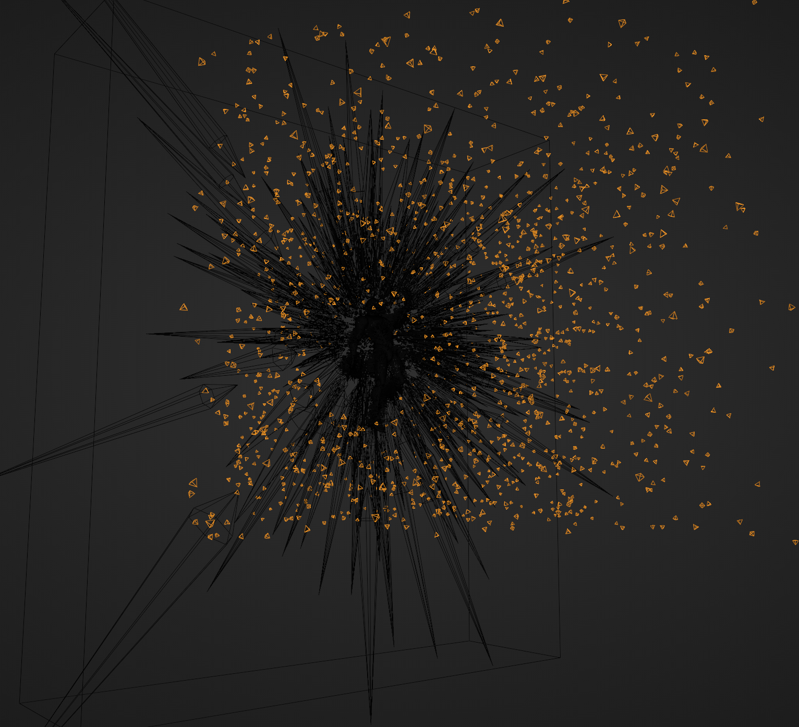
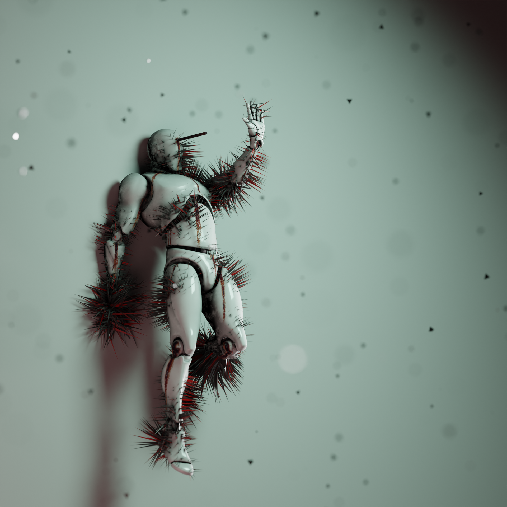

---
date:
  created: 2024-02-13
  updated: 2024-10-01
title: Spiky Wall
image: assets/full lightlypolished.png
description: Gorden Freeman was here, also walls are sharp
codename: hbdgb
---

A heated rebar was insterted to drive the point home that the character is pinned against the wall.

## Geometry Nodes tech
Funny business was making sure not to poke through the body.
A simple blocker was intruduced that roughly matches its shape.
Spikes are emitted from an empty and checked against the blocker.
Smaller spikes on the body are basically a gamble with the noise seed.

<video controls="true" allowfullscreen="true" poster="">
  <source src="../../../../hbdgb/assets/blocker.mp4" type="video/mp4"/>
</video>

<video controls="true" allowfullscreen="true" poster="">
  <source src="../../../../hbdgb/assets/large.mp4" type="video/mp4"/>
</video>

<video controls="true" allowfullscreen="true" poster="">
  <source src="../../../../hbdgb/assets/small.mp4" type="video/mp4"/>
</video>

## Materials
Adding edge highlights really made the spikes pop and elevated their sharpness.
I do like the simple fake marble that makes the spikes look colder upon ponder.

<figure>
	

		
			
		
		
	

	<figcaption></figcaption>
</figure>

## Particles
Simple prism shards made some good glinting elements that really added to the scene.

{width=75%}

I did punch a hole through in order to make room for a clearer view.

## Early concepts

{width=66%}

## Inspiration
I got my inpiration from some of the works from [Jakub Uhlík](https://www.jakubuhlik.com/).
