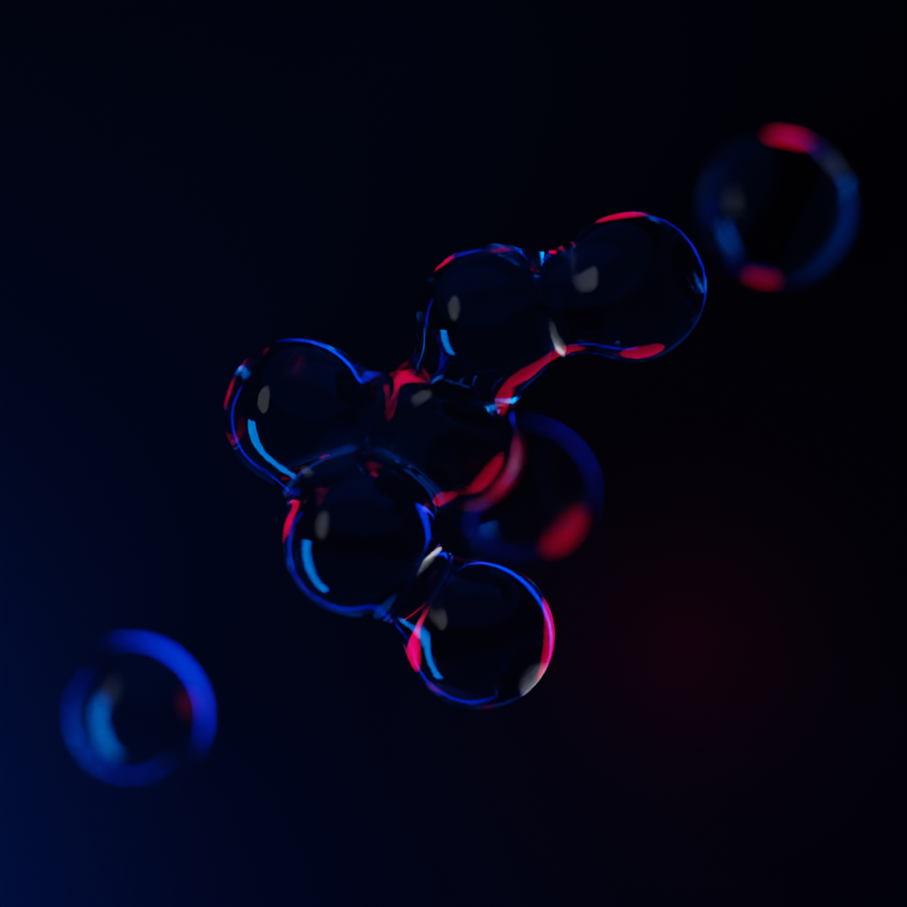
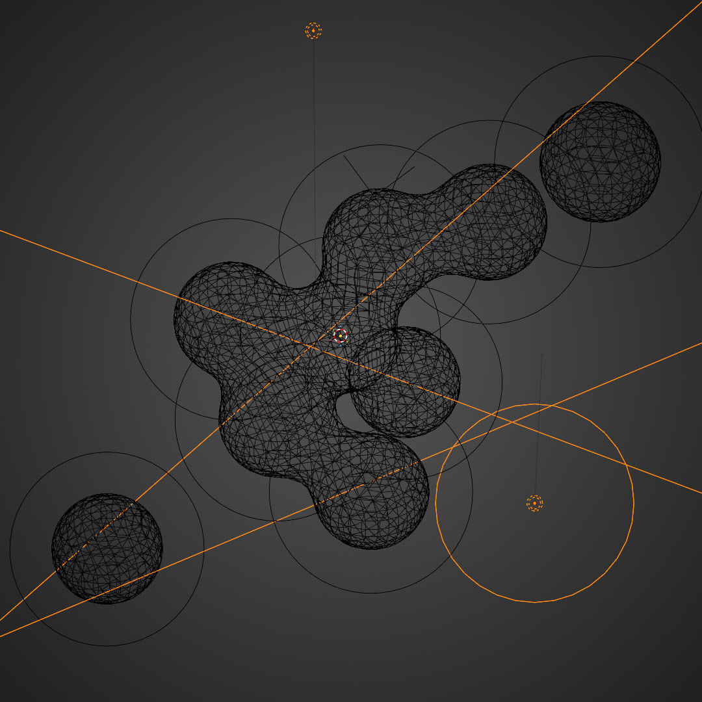

This project actually took longer to render than the actual work on the scene.
At least it ended up on principals wall. 🤷

There is nothing to hide from you. It's as simple as it looks. A few metaballs with glass shader.
Light colors were picked in a hury with volume effect almost muted and voilà!

{width=50%}