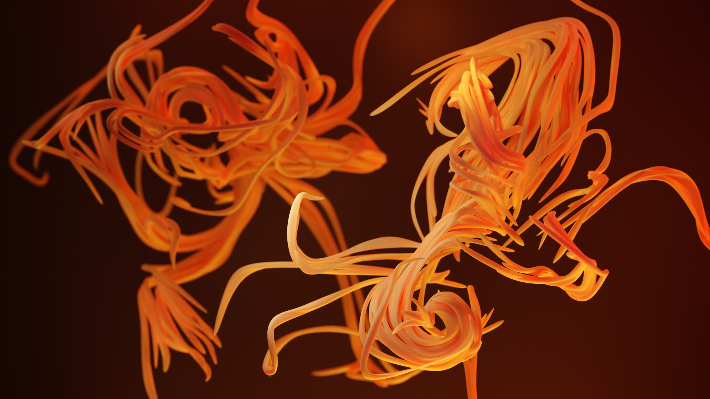
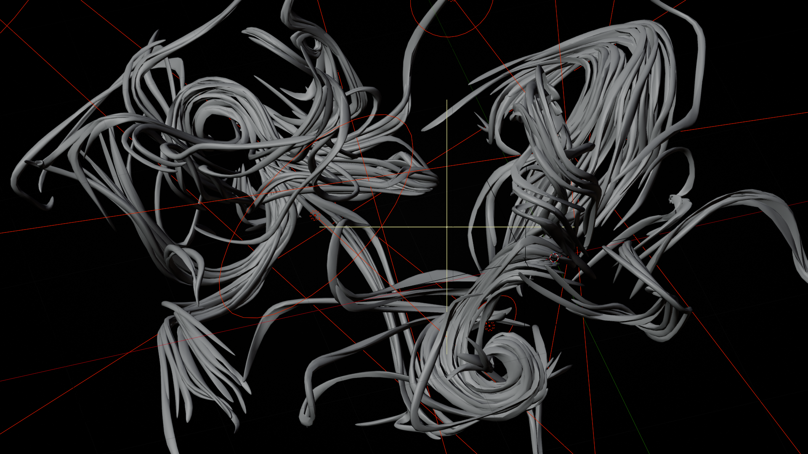
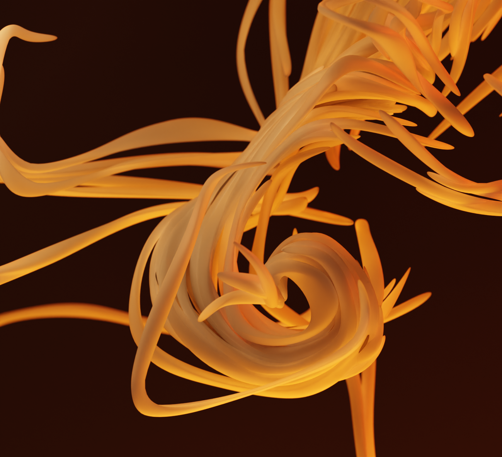

## Shaping Spaghetti
To give the strads a more organic look, I first converted the particles to meshes and applied a Skin modifier in order to give them some thickness.
Then I used a Decimate modifier to break up the amount of topology followed by Subdivision Surface modifier to smooth the result.

## Lighting
All the final color was achieved only with lights. You can ponder the cluster fuck of a lighting setup with the lights highlighted in the image below.

## No Simulation
Non dynamic hair simulation is always fun.

<video controls="true" allowfullscreen="true" poster="">
  <source src="../../../../mohr/assets/viewport.mp4" type="video/mp4"/>
</video>

The turbulence noise always achieves nice curls.

