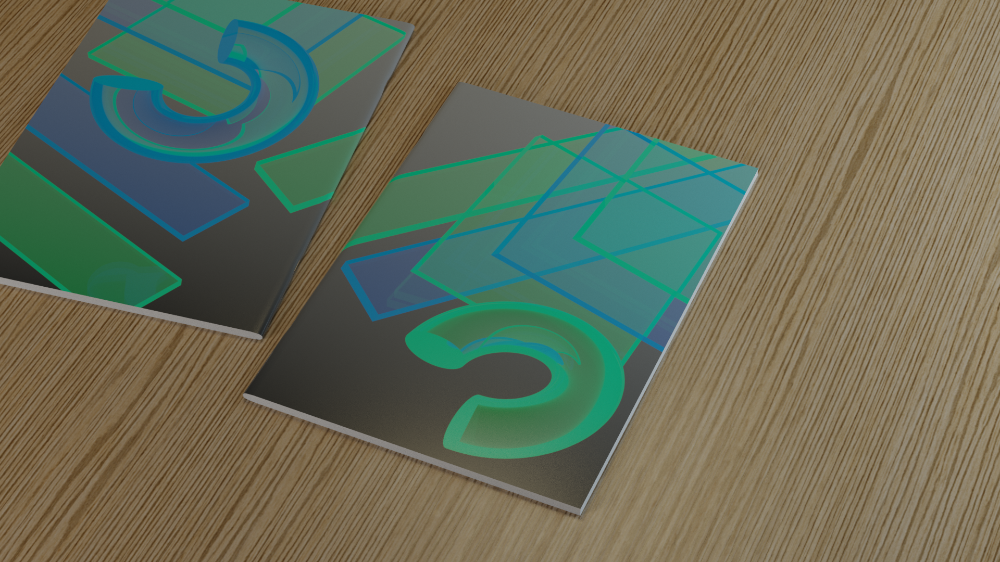

---
date:
  created: 2021-06-21
title: Notebook
image: assets/overview.png
---

My school held a notebook-cover design competition in collaboration with [Papírny Brno](https://www.papirnybrno.cz/). I submitted two designs, and both were selected: one featuring geometric shapes and the other with hot air balloons.

As a digital artist, I was curious (and a little nervous) about how my RGB colors would look in CMYK print. To play it safe, I chose a simple palette of light colors. At the end the colors turned out beautifully! My favourite is the cyan and magenta one on gray bacground.

## Shapes

## Hot Air Balloon

Only orange version got dropped. At the client's request, it was replaced with pink. One of the most confusing instruction as a starting beginning artist was something along the lines of: “Could you make the background pink without the pink balloon getting lost?”

## Printed
Thanks Papírny Brno, I borrowed some of your images...

One thing that still sticks with me is: Who tf decided the **yellow** thing was really that necessary?

