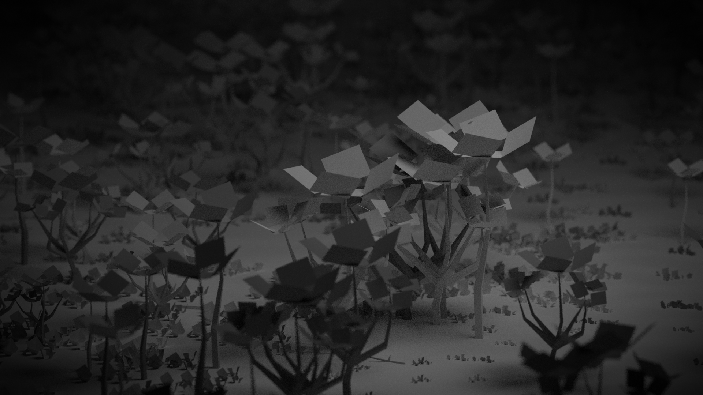
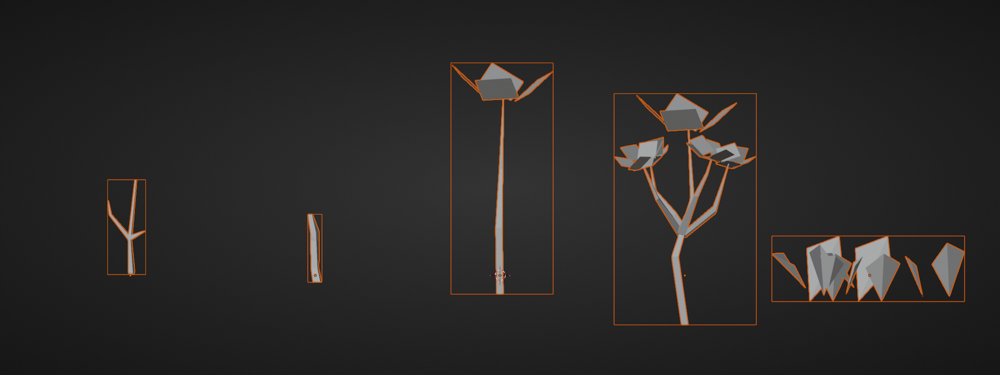

## Particles
No geometry nodes were used - just some simple hair particles.
Sometimes it's just easier to play with sliders than to connect bunch of funny boxes.
One important setting to mention is **clumping**, which creates a more natural feeling distribution. 

## It's just plain planes
The most polygon heavy object is the grass - it's a bent plane.

