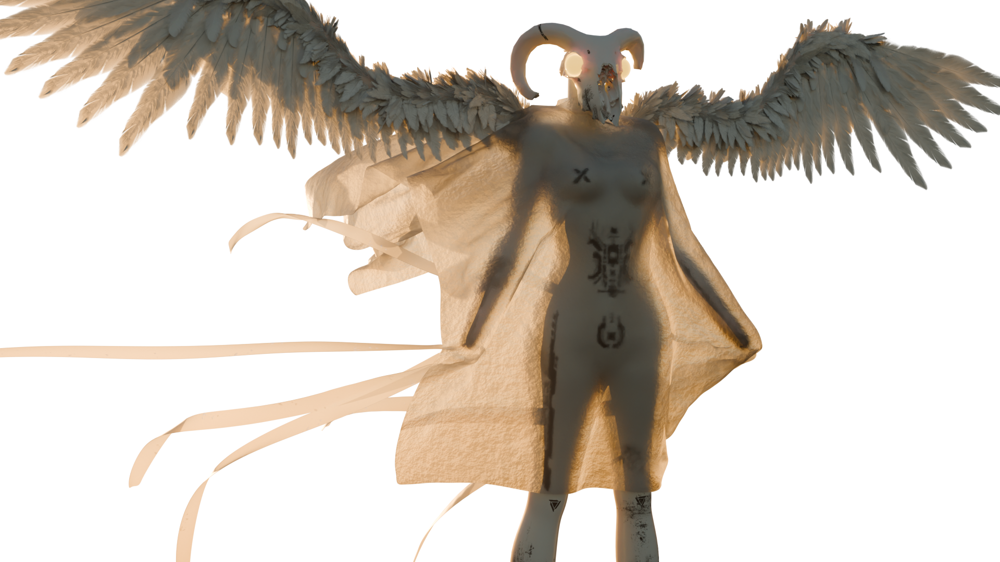
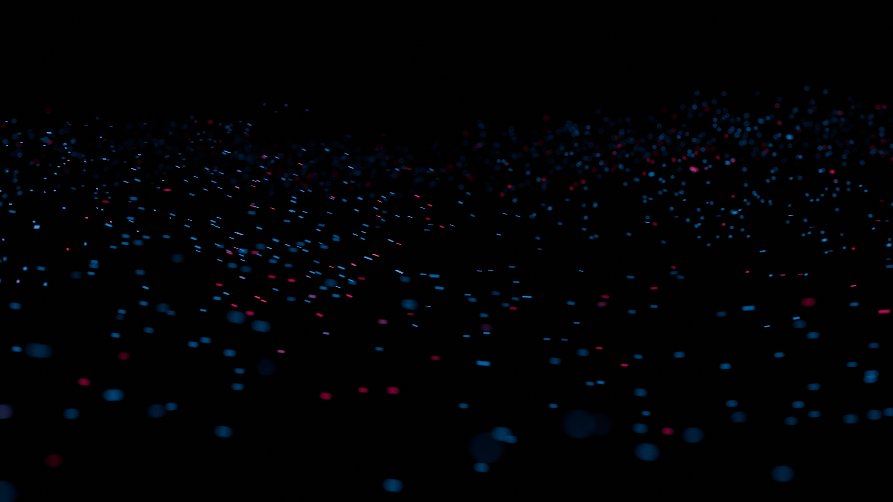
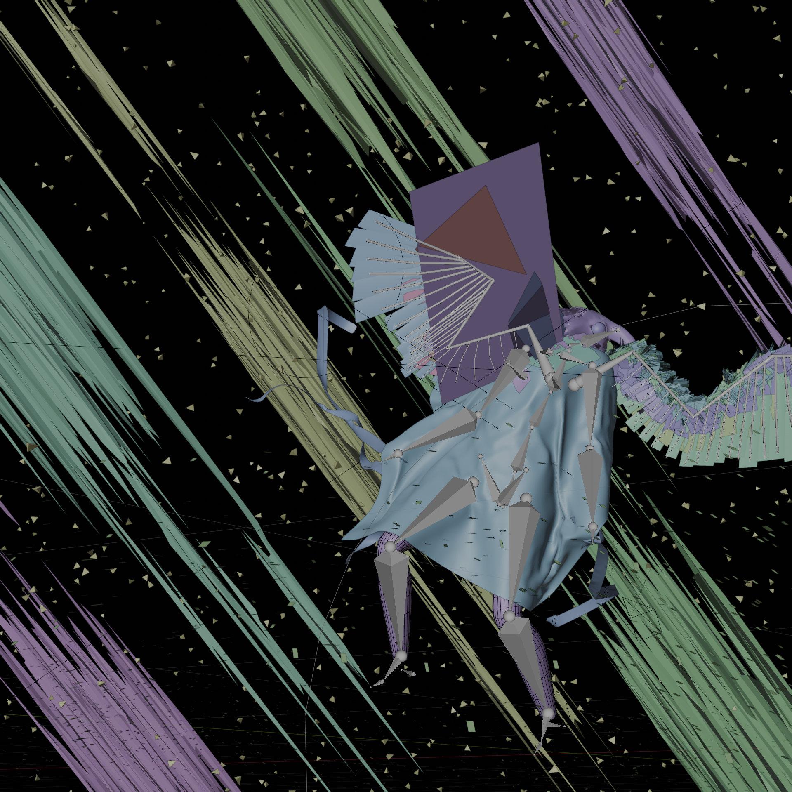
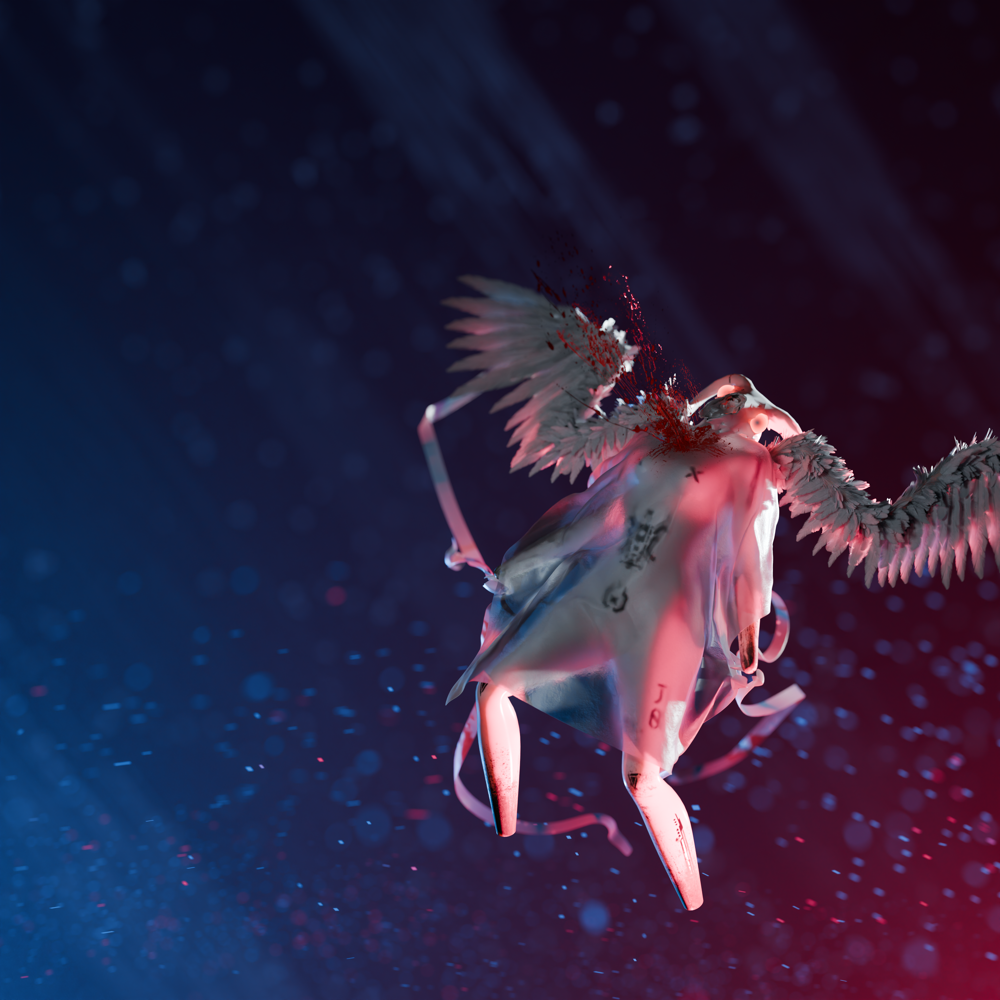

---
date:
    created: 2024-10-28
    updated: 2025-06-03
title: Shline
image: assets/keep-working-and-reworking.png
codename: shline
description: Keep working and reworking
---

## Character
I was too lazy to model a head, and the whole image is meant to feel unsettling anyway.

### Materials and Texures
Getting the cloth material to a usable was tricky. Dialing in the translucency took a while. As for the feathers I have to say they simply overshadow any other qualities of the character.

I used simple stencil brushes to transfer some mud textures and decals. These were painted onto a separate texture to make alpha channel available for mixing of shaders.

The blood material was made a bit glowy to make it pop a bit more. Shading always made it too dark.

### Rigging
Rigging individual feathers is really painful. However, the result is worth it. Some filler feathers were made to stretch.

<video controls="true" allowfullscreen="true" poster="">
  <source src="../../../../shline/assets/wing.mp4" type="video/mp4">
</video>

### Cloth
The cloth does look like some kind of table cloth and that was the goal. Nothing fancy, just something to put over that hideous sqaure ass.

<video controls="true" allowfullscreen="true" poster="">
  <source src="../../../../shline/assets/cloth.mp4" type="video/mp4">
</video>

## Particles
This time, the particles were distributed with the flow in mind. Their rotation is aligned with the normal of the displaced plane they follow.

Background particles are there just to break up the gradient.
The rest of the background consists of simple stretched out streaky shapes.

## Early versions
{width=50%}
