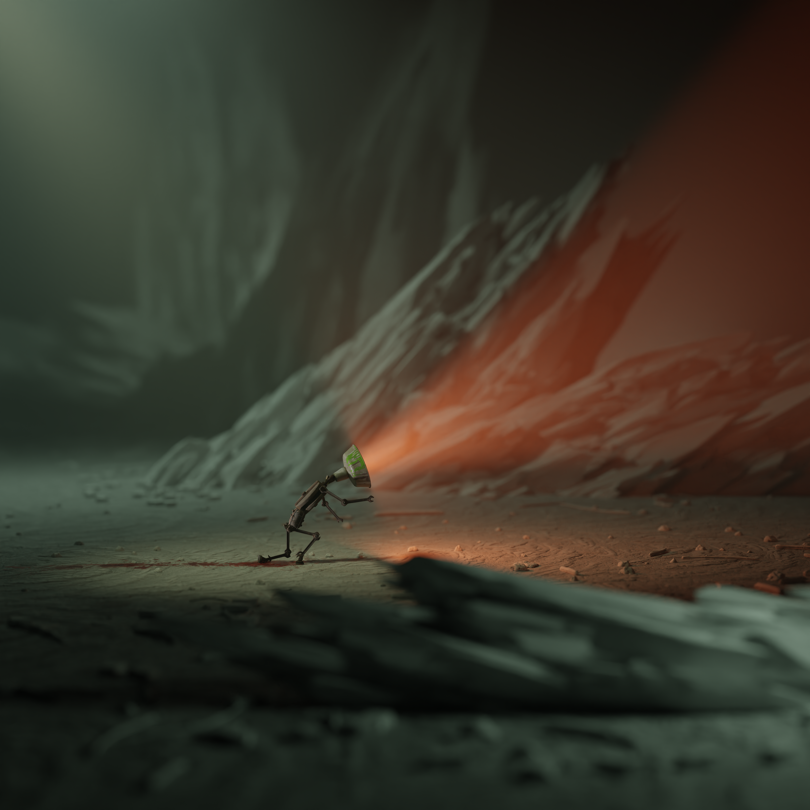

## Character
He’s a kitbash of random assets, roughly fitted together and that’s about it. Yep, no bulb in the fixtre - it's not visible anyways.
I keyed out the paint color to make it fit the scene better.
I still haven't decided whether the trail is blood or oil.

<video controls="true" autoplay="true" muted="true" loop="true" allowfullscreen="true" poster="" width="75%">
  <source src="../../../../sithrl/assets/lazyrecolor.mp4" type="video/mp4"/>
</video>

## Pro Tip
Take some rubble, stretch it af, ta-da! spikes!

<video controls="true" autoplay="true" muted="true" loop="true" allowfullscreen="true" poster="">
  <source src="../../../../sithrl/assets/spikes.mp4" type="video/mp4"/>
</video>
