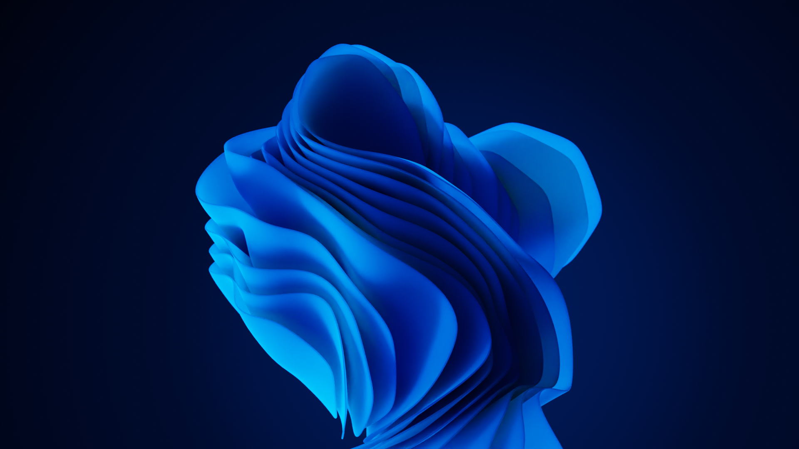

---
date:
  created: 2022-01-07

categories:
  - abstract
title: Weleven
description: Windows 11
image: assets/w2.png
---

## Inspiration
As you might have guessed this work is inspired by Windows 11 wallpaper.

There was this temptation to unveil the softness yet light structure of this concept.
The material clearly has some subsurface scattering going on. At the end getting to this result was more of a compositing work.
Work on the shape wasn't easy. The cloth needs to look soft but not too much crumbly.

## Simulation
Here you can see the simulation itself. I was constantly modifying, adding, and removing forces until I got a usable result.
This was maybe like third entire attempt.

<video width="50%" controls="true" allowfullscreen="true" poster="">
  <source src="../../../../weleven/assets/sim.mp4" type="video/mp4">
</video>
