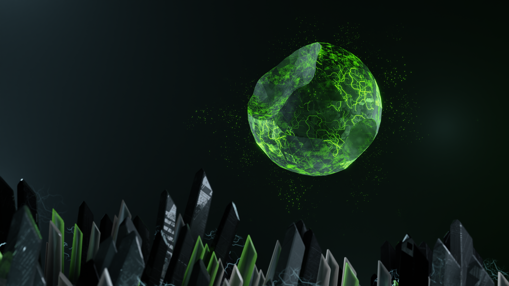
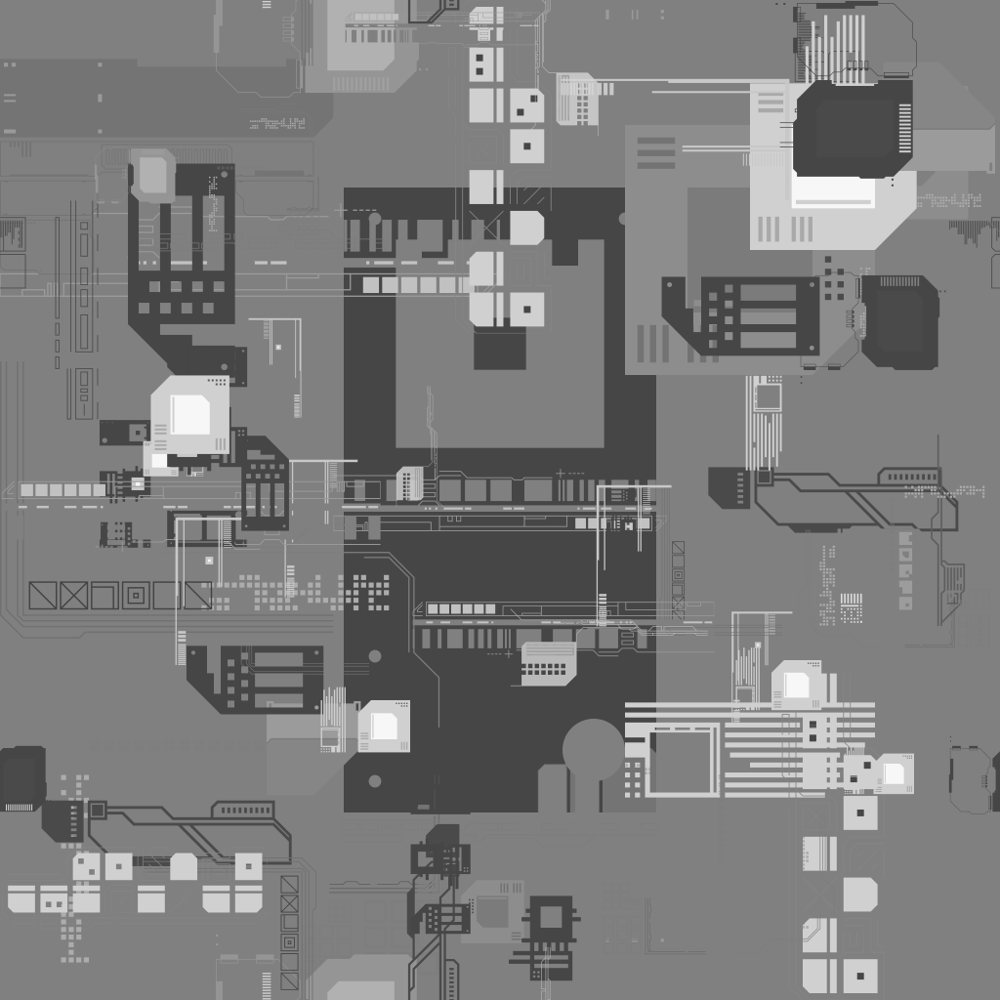

## Textures

Some interesting textures were made with **JSPlacement**. Sadly, JSPlacement is [dead](https://www.reddit.com/r/blender/comments/zfwmjr/does_anyone_know_what_happened_to_jsplacement/). Its legacy can be found [here](https://github.com/satelllte/JSPlacementWeb) and [here](https://archive.org/details/jsplacement-1.3.0-allplatforms_202108). Modern alternative is called [Displacement X](https://github.com/satelllte/displacementx).

All the best to [Windmill](https://hello.windmillart.net/)!

