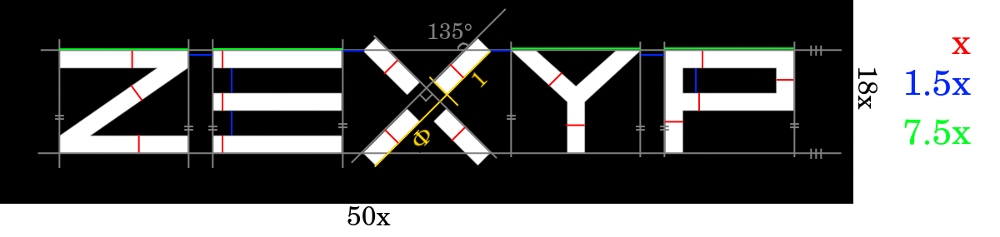
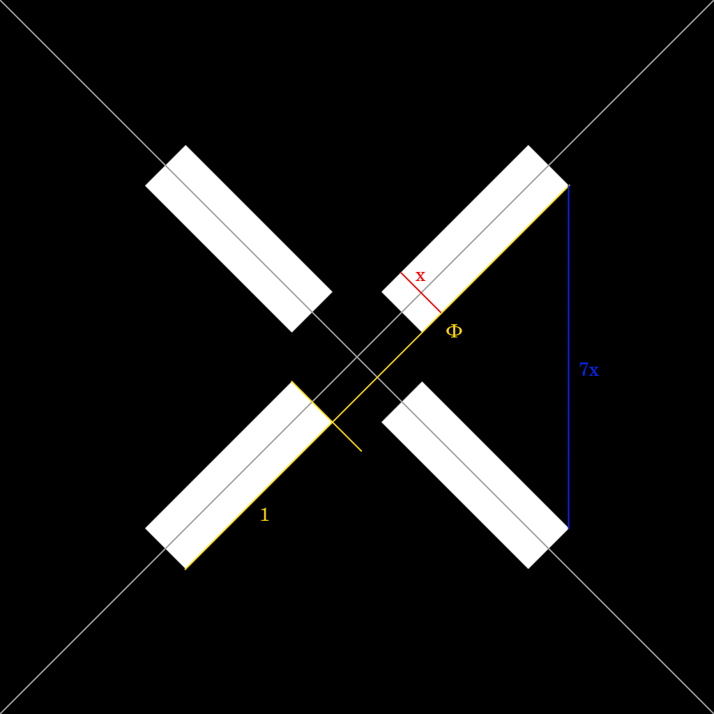
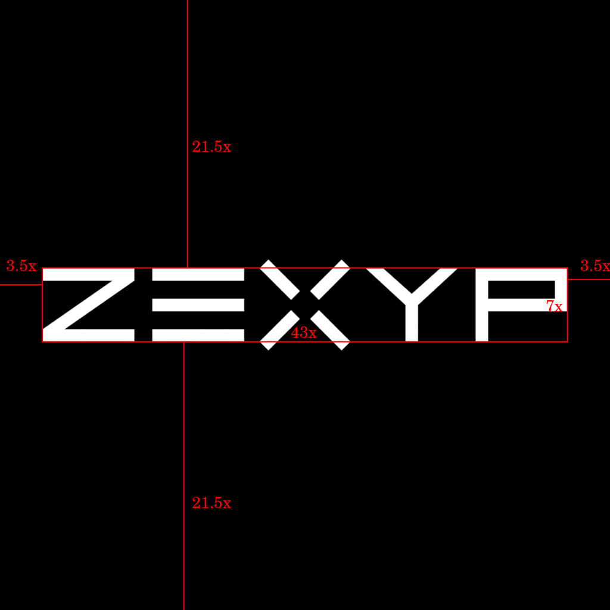
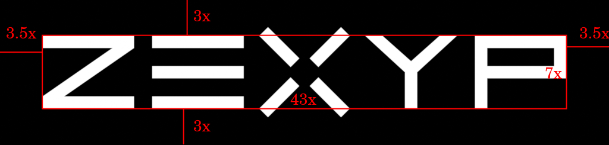
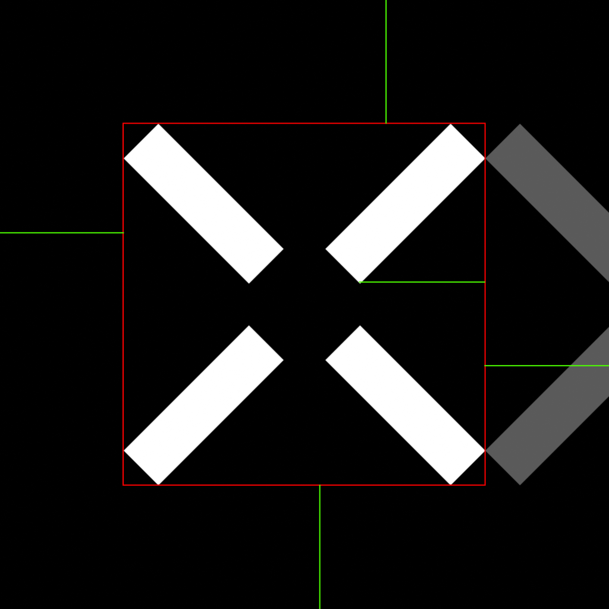
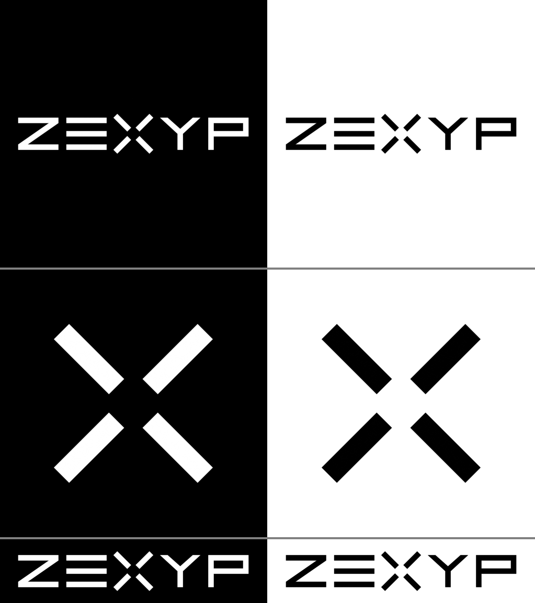

# Logo Manual

## Variants
### Full
#### Square

#### Thin

### Iconic

## Construction
\

For full square version use square.

## Safe Areas
#### Square

#### Thin

### Iconic

## Colors
BW and WB.

## Dos and Don'ts
> The checkmars are only for good feeling. They are also a don't!

- Do use allowed safe areas. Choose by situation.
- Don't use inappropriate safe areas.

- Do leave the logo without rotating.
- Don't rotate the logo.